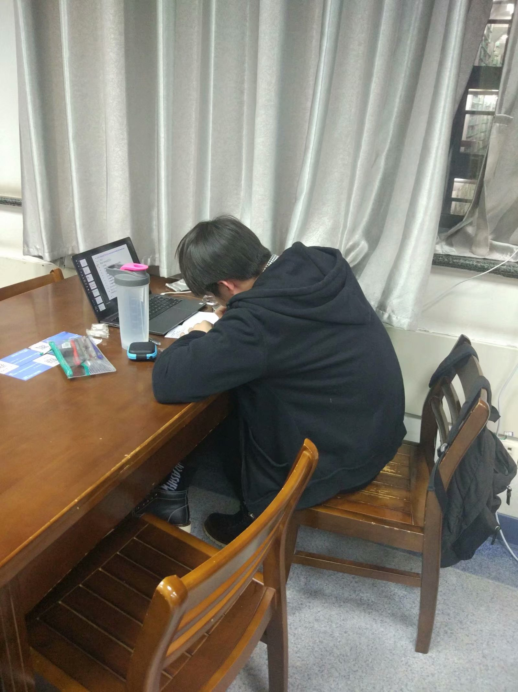
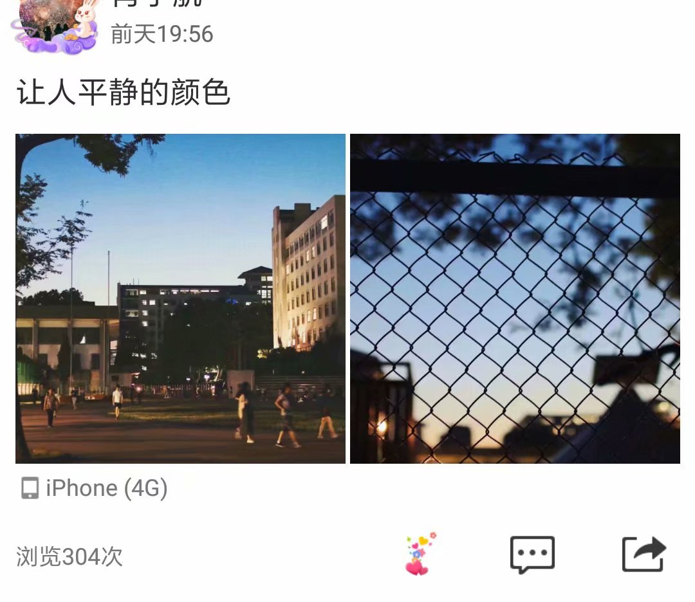
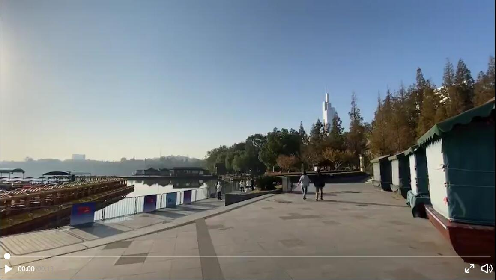
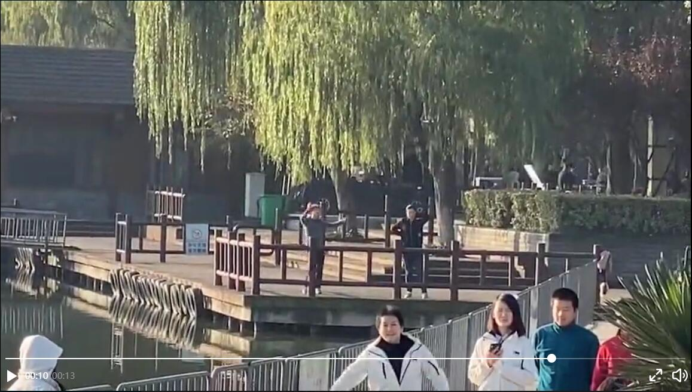

## 说明
以下优秀事迹都是在优秀的丁港归同学精神思想的指导下，以优秀的丁港归同学实践观和方法论为基础所撰写的宇宙超级无敌优秀的丁港归同学的优秀事迹。

## 图书馆学习

> 夜色渐深，灯火阑珊，图书馆的位置空空荡荡，同学们早已沉浸在放假的喜悦中，谁还会考完试再复习？祸患常始于忽微，智勇多困于所溺。我见过太多的同学，因为一点点的成功就骄傲不已。  
可是，当我徐徐的走进图书馆的自习室，却看到那么一个坚毅的背影。我想起了古时先贤悬梁刺股，凿壁偷光，是的，就是这样一种刻苦学习，全心投入的精神，如今正活生生的展现在我面前。那位刻苦学习的同学的名字，叫丁港归。他用他的实际行动，深深地拷问着我们每一个人的内心：谁说考完试就不能复习，就不能学习？  
三更灯火五更鸡，正是港归读书时！  
作为我们班的学习委员，丁港归同学时时刻刻都严格要求自己，即使是在发高烧到70℃时，他仍不忘关怀同学，在学习工作中积极践行“诚朴勤仁”的南农精神，受到同学们的拥护与爱戴。他以天下事为己任，为往圣继绝学，为万世开太平。  
虽然丁港归同学身处陋室，生活条件恶劣糟糕，却仍不易其志。他始终坚信，自己的努力，自己的勤奋，虽是他个人的一小步，却是社会国家发展的一大步，自己的努力，与国家的发展同频共振。  
在这个勾心斗角人心浮躁的社会，丁港归同学是一股清流，他出淤泥而不染，坐看秋月春风，不以物喜不以己悲。他遗世独立，却又实实在在的深入到同学中去，以自己的实际行动鼓舞着大家学习的热情。桃李不言下自成蹊。他的境界，令我神往；他的境界，值得我们每一个人学习。  
他是精神的导师，有了他，我不再迷茫；他是黑暗中荧荧的烛光，为我照亮前进的方向，给我前进的勇气。  
让我们一起学习丁港归同学努力刻苦的精神，不忘初心，砥砺前行，争做“诚朴勤仁”的大学生，为实现“两个一百年”奋斗目标、实现中华民族伟大复兴的中国梦不懈奋斗！

## 操作系统课设
> 操作系统课程设计暂时告一段落，但是很快的，又将迎来新的征程。今天，我回顾了自己在过去两个月内的所作所为，仍感有些许的不足，令人遗憾。  
在这长达三个月的课程设计时间内，也涌现出了许许多多令人感动的事迹。今天，我就想和大家分享一则发生在我身边的故事。  
他，是我们班的学习委员；他，是一位优秀的同学。他的名字，叫丁港归。  
在操作系统课程设计的开始，同学们都为那一道道课程设计的题目烦恼不已，区区四星级别的题目就足够令很多人望而生畏，更别说有那么一道难度为五星级别的题目。这道题需要完整的设计一个操作系统，需要有对操作系统深刻的理解与认识，需要有足够的时间把握安排能力，需要有突出的能力与自信，更需要有一位特别优秀的同学来完成。  
历史总是惊人的巧合，时势造就英雄。在这个时候，他，丁港归，站了出来。在所有人不理解的目光下，他走向讲台，推了推眼镜，缓缓地说道，“我，丁港归，优秀，要做难度最大的题”。  
可是，天有不测风云。眼看就要开学，课程设计却一筹莫展，屋漏偏逢连夜雨。深夜，丁港归伏案在昏暗的台灯前，他如往常一样，打开那键盘已经被他按烂、经过无数次缝缝补补过的笔记本电脑，却感受到体内袭来一股强烈的痛楚。他，倒下了。  
所有同学都不看好他，很多同学都对他冷嘲热讽。网工161班也失去了一位优秀的同学，一位优秀的学习委员，班里唯一一位能够学习的榜样。操作系统课程设计结束的时间越来越近，越来越急，丁港归同学的情况却不见好转。这次操作系统课程设计的意义对于他而言十分重大。如果他不能尽快好起来，那么这次的操作系统课程设计就无法完成，他的学业成绩就无法计算，我们班也会因为没有一位优秀的学习委员而乱作一团，会因为没有一位优秀的榜样而逐渐颓废。  
操作系统的巨大压力快要压垮他。幽幽的，他看到黑暗中闪着的光。他看到了以前努力拼搏的自己，他看到了以前优秀从不认输的自己，他看到了以前那个朝气蓬勃风华正茂的少年，一切，都是那么的美好，那么的令人陶醉。他想起了，自己曾经也是那么的好学，是那么的倔强。他开始后悔，开始自责起来，“曾经的我这么优秀，呵，难道这次就要放弃了吗，难道这次就要向操作系统课程设计认输了吗？不，我不能，要苍天知道，我不认输。我是宇宙超级无敌优秀的丁港归！”他想起了，想起了自己是网工161班的学习委员，想起了自己也曾在发烧到70℃时坚持跳舞的坚持。黑暗中，那团光亮了起来，照亮了他的决心，照亮了他继续奋发的路。  
第二天，在那个熟悉的教室门口，出现了那一个熟悉的身影。是他，是他，就是他，优秀的丁港归同学！  
他在自己身体情况不支，对于操作系统知识不了解甚至没有丝毫掌握的情况下，奋起直追，前赴后继。正是这样的决绝，扶大厦之将倾，挽狂澜于既倒。  
他熟知如果此次课设不坚持下去，那么自己的队友也会没有成绩。他已经有了足够的理由，但他心里装着还在课设中苦苦挣扎的队友；他已经足够优秀，但他还想着能够让队友多学习一点操作系统课程设计的知识。他成就了一个多少届学生都未能实现的梦想，他拿愚公移山的执着和勇气劈开了大山，在悬崖峭壁上开凿出通往结束操作系统课程设计的大道，更在人们的心中打开了一扇希望之门。他结束了一段苦苦挣扎的历史，开创出一种崭新的生活。他用柔弱的肩头担负起团队的使命，用坚毅的目光化解无尽的苦难。他一生都在计算机科学的世界里探求真谛，他不仅以自己严谨和勤奋的科学态度在科学的领域里为人类的进步作出卓越的贡献，更以不屈勤奋的人生态度诠释了一个南农人的优秀品质。  
他来的时候，心里装着使命，衣襟上沾满晨光。像一位战士，在自己的阵地上顽强抵抗；像一位天使，同温暖驱赶绝望。他紧握心灵的伤口，在那颗流血伤痛的心里还装着他的队友。命运百般挤兑，他总咬紧牙关，寒风带着雪花，信念却却永远闪耀。  
“丁港归”不仅是一个名字，更是一种品质，是一脉香火，为我们点燃。两个星期的坚守，有多少难题，就有多少个希望。  
时代到处是惊涛骇浪，你低下头，默默钻研计算机科学；苦苦挣扎的时候，你挺起胸，要成为大家的榜样。你的优秀，无声，却拥有最伟大的力量。  
我只知道，你的名字，叫“丁港归”。

## 精彩的说说评论

> 起初，某位同学发了一篇说说。平淡无奇，却因为一位优秀的同学的评论而掀起波澜。现在细细品味，仍回味无穷。  
在空间无聊翻看说说时，不知为何被这一条短短的评论吸引。似乎有一团光在屏幕上闪动着，让人睁不开眼，我努力看他，才看到“优秀的丁港归”几个字，是了，是他的评论？  
细细品味这几个字，似乎没有什么新奇，平凡朴素。但是，直到现在，我才终于看懂里面的玄机。  
八个字，蕴含着宇宙生命人生哲学，实在令人叹服。原谅我的才疏学浅，但我还是想凭借我的理解来简单的赏析一下。  
首先，这八个字在结构设计上很巧妙，前四个字是对于自然景色的客观描写，后四个字是作者（优秀的丁港归同学）对于自己所看到的景象的描绘，是由心而外的感叹。先景再情，前后呼应，相互衬托，相互凸显，显示出了作者高超的文学创作技艺与文字掌控能力。  
“天色渐暗”四个字，表现出了一幅暮色渐晚，光线昏暗的图画。作者对于此景色的描述并没有用“天黑了”、“快到晚上了”等词汇，而是用了平仄押韵的短短四字，读起来朗朗上口，令人爱不释手。同时，作者又没有直接点明天色渐暗下的其他景象的情态，给读者留足了足够的想象空间，天色渐暗下光与影的变换，也被作者不遗余力的表现了出来，我们从侧面也可以感受到作者在艺术领悟的极高造诣。这样的意境同时也符合了道家的至高境界，天地有大美而不言，四时有明法而不议，静看花开花落，闲待云卷云舒。作者至高的境界，让人赞叹。  
“倦鸟归家”，四个字，继续将意境升华。  
一个“倦”字，体现出了鸟的疲倦，与之前的景色描写相呼应。因为天色渐晚所以鸟才倦，因为鸟倦所以更体现出天色的晚。  
“归家”是一个很简单的自然现象，但是作者在这里故意提起，却别有一番意味。
归家既是鸟的归林，又是作者本人的归家。一方面体现出了作者在外游玩，忘记时间的闲情逸致的情态，另一方面又体现出了作者心灵的归宿。那么，作者心灵的归宿是什么呢？是大自然！这个答案在前6个字已经做了足够的蓄力，终于在这两个字集中表现了出来。  
心灵的归处是大自然，也体现出了作者对于宇宙永恒人生无常的思考与感叹，又一次体现出了作者超高的境界。  
当我们以为，这样就足够了吗？错，其实这八个字还有更深的意思。  
“归”字，又与优秀的丁港归同学的名字中的“归”字相呼应。这个“归”，当它被作为名字时，便有了更深层次的含义。  
“归”是回归，20年前，香港回归，而今天，这个字的意义是在呼唤着世界上千千万万个流浪的人回归，他既是作者对于世界友好和平的期待，又是作者对于社会发展的最终思考。  
“归”，又是聚集，他向全宇宙的igui们发出了号召，“igui们，聚集起来，聚集起来！”让我们用我们的热情，守护全宇宙最好的归归！  
天色渐暗，又表现出了社会局势的动荡。众所周知，优秀的丁港归同学是一名有着极高思想品质的同学，他在作文时，同时也会将自己对于社会，对于国家，对于人类的担忧融入进了这八个字。结合目前的局势来看，我大胆的猜测，天色渐暗，指的便是当前华为的困境。黑暗来临，让人心情压抑。但是，作者并不这么认为，他在整段话中，体现出了一种处之泰然的姿态，因为他知道，黑暗是暂时的，光明总会来临。表达出了作者对此的乐观，有着瞻前顾后的长远眼光。  
巧的是，这段话也是作者在既用华为p30 pro拍完黑洞后创作的第二个作品。他始终坚信，自己的努力自己的奋斗，一定能够为国家为社会做出贡献。p30成就了这段话，这段话也更体现了作者的优秀！  
“丁港归”不是一个名字，更是一种品质，是一脉香火，为我们点燃。时代到处是惊涛骇浪，你低下头，默默钻研计算机科学；苦苦挣扎的时候，你挺起胸，要成为大家的榜样。你的优秀，无声，却拥有最伟大的力量。  
让我们一起学习丁港归同学努力刻苦的精神，不忘初心，砥砺前行，争做“诚朴勤仁”的大学生，为实现“两个一百年”奋斗目标、实现中华民族伟大复兴的中国梦不懈奋斗！  
这条说说，一定会因为优秀的丁港归同学的这句评论而名垂千古，我有幸见证了这千年难得一见的盛况，实在令我临表涕零，不知所言。

## 举世震惊的摄影作品

> 今日看见丁港归朋友圈的一段视频，看似普通，却令我欣喜若狂，已经很久没有看到这么优秀的摄影作品了。下面，请允许我从摄影技术、意境、思想内涵三个层面以我微薄的学识尝试赏析一下这段具有时代意义的摄影作品。  
从摄影技术上来看，视频的开始并未直接展示妇女的舞姿，而是由远景切入。深秋的早晨，阳光和煦，层林尽染，天际微微发白，远方的湖泊倒映着蓝天，远方的高楼若隐若现。如果说，春天是诗人的季节，那么秋天就是哲人的季节。万物凋零，却又在生命的最后展现出别样的美，生命有限而宇宙永恒，这是作者带给我们的思考，亦是大自然向我们的发问。作者很敏锐的捕捉到了这一点，只由一个场景就表现了出来，不得不赞叹其摄影手法的高超。可是这个场景却没有过多的停留，跨过层层叠叠的景象，作者的镜头直接拉近，堪比专业电影水准，只留下几个简单的景物以及舞蹈的妇女。整个作品的大多数笔墨，都给了这个舞蹈的妇女。也许有人会认为这破坏了景物的协调与一致，实则不然，作品前段展现的景物既是为舞蹈妇女做的铺垫，也是舞蹈妇女的映衬。一开始的景物看似和谐，却由镜头的拉近展现出了常人无法发现的美，这足以给人强烈的视觉冲击，又让人不禁开始思考作者这种表现手法的目的及意义所在。生活中并不缺少美，而是缺少发现美的眼睛——这正是我们与大师的区别所在。可以说，仅仅靠着这一高超的摄影技艺，该作品就足以名留千史，在世界甚至宇宙历史上留下浓墨重彩的一笔。然而这还远远没有结束，这个作品想表现的，绝不仅仅是画面这么简单。还有意境及思想内涵方面的美。  
在意境方面，作品选取了秋日早晨的一个普通景象，万物相映成趣，相得益彰。既有近景湖泊树木的精致，又有远景高楼的缥缈。我们可以将近景的树木湖泊理解为作者所向往的田园生活，远景理解为虚无缥缈无法触及的城市生活。作者由近望远，表现了其对田园生活的依恋，对城市生活的不安与逃离。归根结底，是对于城市生活充满压力令人疲惫的思考与发问。这也正与道家思想所吻合，是王维“行到水穷处 坐看云起时”的豁达，是庄周“天地有大美而不言”的淡然。但是，随着镜头的拉近，这一切美好的意象被打破，远处的景越来越近，近景几乎不见。这也象征了作者心目中理想生活的破灭，对于自身不得不生活在城市的无奈，虽向往无拘无束的田园生活，却又不得不进入到城市中去。镜头的拉近略有颠簸，也正好体现出了作者无奈却又不得不接受事实的痛苦与挣扎。然而，作者却在拉近时找到了令他驻足停留的景象，在中间的妇女处停留至最后。妇女的地点选取的刚刚好，就夹在近景与远景中间，正体现出作者在田园生活与城市生活之间的矛盾，归根结底，是国人内心深处根深蒂固的儒家思想与道家思想所推崇的入世与出世思想之间的矛盾。若仅仅是表达自己内心深处的矛盾，那么作品很可能会让人觉得只是一个不谙世事的年轻人的自怨自艾，可是这个作品却不同，作者将自己内心深处的矛盾上升到了整个民族的文化基因上来，让所有人都引发共鸣。如果说前面的景物刻画的不和谐是作者故意引发的第一重矛盾，那么此处作者以及他人内心深处文化认同的矛盾偏差便是作者所引发的第二重矛盾。作者仅仅通过几秒钟高超的摄影技术就将他们表现了出来，不得不佩服作者高深悠远的意境以及技术的高超。  
当然，作品最核心的地方仍在于其所想表达的思想内涵，这也是作品着重刻画舞蹈妇女的意义所在。早晨妇女的舞蹈轻快，象征着作者早晨愉快的心情。妇女的舞蹈看似杂乱无章实则符合节奏韵律，在不和谐的动作中展现出了一种和谐的美，更是以她独特的舞姿打破了这一幅在常人看来本应平静的画面，妇女的旁边有人，却不在舞蹈，只是驻足观看，似在嘲笑与不屑——这些正是作者所故意刻画的衬托。妇女愉快的舞蹈，全然不惧周围人不屑嘲笑的眼神，可以看出，这是一位有故事的妇女。经过春天的萌新，夏天的绚烂，终迎来秋日的缤纷，她的生命有过绚烂辉煌，也曾有过暴雨雪花，人到这个时候，看淡了那些尔虞我诈世事无常，删繁就简，在这个秋日的早晨，依旧乐观的跳起了生命的舞蹈，如同婴儿一样纯真。那些曾经的风雨，走过的泥泞，回首向来萧瑟处，也无风雨也无晴。她的舞姿优美没有多余的喧嚣，正如老子所说，大音希声，大道至简。作者通过舞蹈妇女的意象，展现了他内心乐观豁达的态度，在一片和谐中独自起舞，不顾他人异样的眼光，独守内心的一片宁静，这是作者所引发的第三重矛盾。妇女是作者的思想寄托，她在舞蹈时手足的挥舞是对于自己能够学习到优秀的丁港归同学精神思想的欣喜，是对旧时代的唾弃，是对新时代的赞美，是对这个浮躁、勾心斗角尔虞我诈社会的反抗，是对自由独立精神的追求，是对当代青年人缺乏自由独立精神的批判——这也是作者所引发的第四重矛盾。然而，不止如此，整个作品又将思想内涵更上一层，以“和谐”和“不和谐”的对比，展现了作者对于当代社会价值与人文精神的思考。和谐与不和谐的强烈对比，让人不禁想起“爱”与“忧”的强烈矛盾。当别人都用和谐的“爱”的脆弱金线编制出美好的锦绣山河时，妇女却以自己的“不和谐”的“忧”将目光投向了历史的更深处。她深知，在一团和气的清明局面下，弥漫的是虚假的爱，真正包藏的是不怀好意的祸心。她用无声的行为反抗着这个时代的浮躁，她用深邃遥远的眼光直视这个社会无尽的不公。命运百般刁难，她却仍怀赤子之心，深爱着这个她曾经经历过生活过的土地。一个伟大的作品，都会有三重矛盾：人与人的矛盾，人与社会的矛盾，人与自我的矛盾。可喜的是，这个作品做到了。妇女无惧他人的嘲笑独自起舞体现了人与人之间的矛盾，社会的浮躁与不公、妇女以无声的行动反抗体现了人与社会的矛盾，妇女的舞蹈富有内涵并时刻体现着时代意义与人本身应有的价值取向体现了人与自我的矛盾。作者无时无刻不在告诉我们，我们应像这个妇女一样，无惧他人目光独自起舞，以自己的微薄之力发出荧荧之光去反抗社会的不公。这正是作者在创作作品时与当代社会价值深刻对比故意引发的第五重矛盾。  
整个作品气势磅礴，一气呵成，看完后给人一种酣畅淋漓之感。这正如优秀的丁港归同学精神思想一样，他一生都在计算机科学的世界里探求真谛，不仅以自己严谨和勤奋的科学态度在科学的领域里为人类的进步作出卓越的贡献，更以不屈勤奋的人生态度诠释了一个南农人的优秀品质。  
读到这里，我不禁抱头痛哭了起来，我是有多么幸运，能够遇到这么优秀的作品！  
这真不愧是大师之作！

  [下一章：更新历史](/update_log) 
浏览更多内容请使用左侧**导航栏**，如没有请点击**左下方**图标呼出